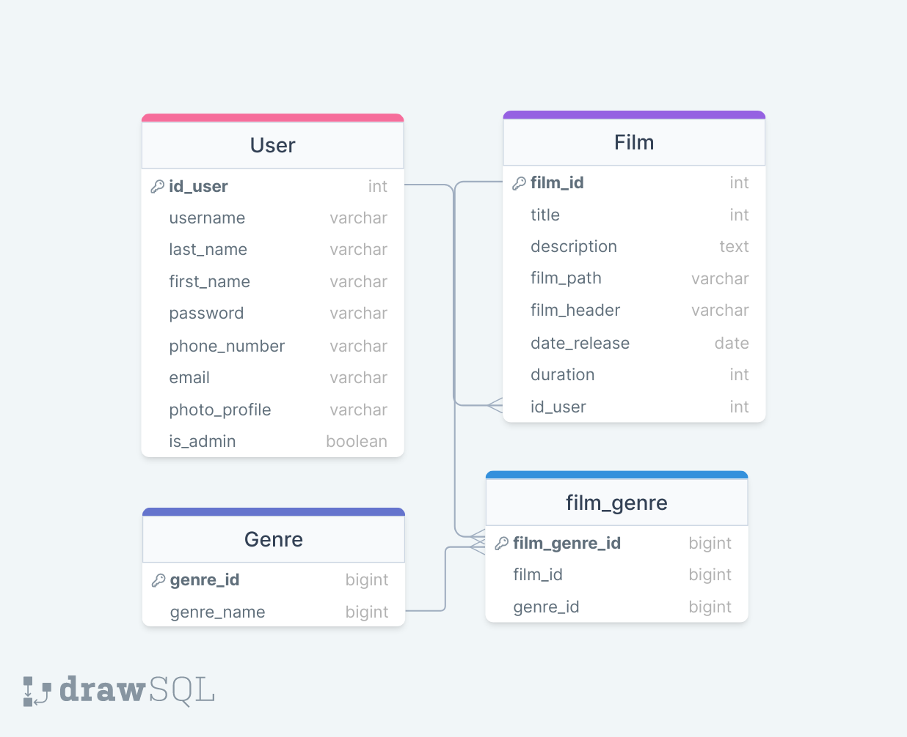

# REST Service for Notflix App
This is a REST Service for Notflix which manage premium films for premium users. This service is created using NodeTS, Express,
PostgresSQL, Prisma and Docker. This service contains management for user to submit and manage their own films. This service also
allows admin premium to manage subscription and users film submission.

## Database Schemes

## Endpoint API

## Prerequisites
1. Make sure your machine has Docker and Docker Compose installed.
2. Make sure your machine has NodeJS installed.


## How To Run
1. Make an .env file based of .env.example
2. Navigate to the root directory of the project.
3. Run the following command:

    ```
    docker-compose up -d
    ```
4. Or you can run it locally
    
        ```
        npm install
        npx prisma generate
        npm run dev
        ```

This will start the Notflix REST Service application using Docker containers.


## Task Division
| Feature             | NIM          |
|---------------------|--------------|
| **Database**           | 13521132     |
| **Authentication**    | 13521130     |
| **Endpoint Profile**    | 13521132     |
| **Endpoint Film**    | 13521132     |
| **Endpoint Subscription**    | 13521165     |
| **Endpoint for Other Client**    | 13521132     |
